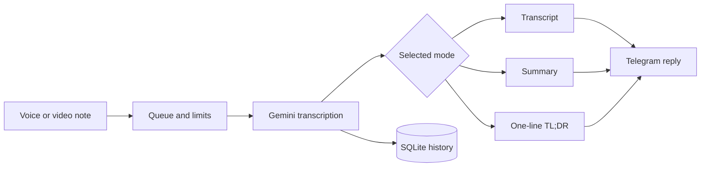

<p align="center">
  
</p>

<h1 align="center">Telegram Transcription Bot</h1>

<p align="center">
  Turn Telegram voice messages and video notes into readable transcripts, concise summaries,
  and one-line takeaways with Google Gemini.
</p>

<p align="center">
  <a href="README.md">English</a> ·
  <a href="docs/README.ru.md">Русский</a> ·
  <a href="docs/README.de.md">Deutsch</a> ·
  <a href="docs/README.uk.md">Українська</a>
</p>

<p align="center">
  <a href="https://github.com/egore4606/telegram-transcription-bot/actions/workflows/ci.yml"></a>
  <a href="https://github.com/egore4606/telegram-transcription-bot/actions/workflows/codeql.yml"></a>
  <a href="https://github.com/egore4606/telegram-transcription-bot/actions/workflows/publish-container.yml"></a>
  <a href="https://github.com/egore4606/telegram-transcription-bot/releases"></a>
  <a href="https://github.com/egore4606/telegram-transcription-bot/pkgs/container/telegram-transcription-bot"></a>
  <a href="LICENSE"></a>
</p>

> [!IMPORTANT]
> This is a self-hosted bot. You provide your own Telegram Bot token and Gemini API key. Never
> commit either credential to GitHub.

## Why this bot

Voice messages are fast to record but slow to revisit. This bot keeps the convenience of voice
while returning content that can be searched, quoted, skimmed, and forwarded.

| Input | Output | Context |
|---|---|---|
| Telegram voice message | Transcript, summary, or TL;DR | Private chats and groups |
| Telegram video note | Speech transcript plus relevant visual context | Private chats and groups |
| Long recording | Safely chunked Telegram replies | Automatic queue and progress updates |



## Highlights

- Four output modes: transcript + summary, transcript only, summary only, or TL;DR.
- Per-chat language and transcript-style settings.
- Separate settings for private chats and every group.
- Background jobs with per-user and per-chat concurrency limits.
- Queue position, live processing timer, **Stop**, and **Next model** controls.
- Primary and backup Gemini keys plus a configurable fallback model chain.
- Safe splitting of long Telegram messages.
- SQLite-backed settings, statistics, feedback, model attempts, and processing history.
- Read-only Flask admin panel available through an SSH tunnel.
- Multi-architecture container images published to GitHub Container Registry.
- Automated tests, container builds, CodeQL scanning, dependency review, and Dependabot.

## Quick start

### Docker Compose

```bash
git clone https://github.com/egore4606/telegram-transcription-bot.git
cd telegram-transcription-bot
cp .env.example .env
# Edit .env and add your real credentials.
docker compose up -d --build
```

Follow the logs:

```bash
docker compose logs -f bot
```

### Pre-built image

```bash
docker pull ghcr.io/egore4606/telegram-transcription-bot:latest
cp .env.example .env
docker compose -f docker-compose.ghcr.yml up -d
```

The image is built for `linux/amd64` and `linux/arm64`. Every main-branch build also receives an
immutable `sha-<commit>` tag.

## Configuration

The minimum `.env` file is:

```env
TELEGRAM_TOKEN=your_telegram_bot_token
GEMINI_API_KEY=your_primary_gemini_api_key
ADMIN_USER_ID=123456789
```

Common optional values:

```env
GEMINI_API_KEY_2=your_backup_gemini_api_key
GEMINI_MODEL=gemini-3.5-flash
MODEL_REQUEST_TIMEOUT=40
MAX_ACTIVE_JOBS_PER_USER=3
MAX_ACTIVE_JOBS_PER_CHAT=5
DATABASE_PATH=/data/bot.sqlite3
```

See [Configuration reference](docs/CONFIGURATION.md) for every variable and default.

## Commands

<details>
<summary><strong>User commands</strong></summary>

| Command | Purpose |
|---|---|
| `/start`, `/help` | Welcome and usage help |
| `/both` | Transcript and summary, the default |
| `/transcription_only` | Transcript only |
| `/summary_only` | Summary only |
| `/tldr` | A single-sentence takeaway |
| `/language [code]` | `auto`, `ru`, `en`, `de`, and other language codes |
| `/transcription_type [clean\|verbatim]` | Readable cleanup or verbatim transcript |
| `/stop` | Cancel the latest active or queued job in this chat |
| `/next` | Switch the latest active job to the next Gemini model |
| `/feedback [text]` | Send feedback to the bot administrator |
| `/changelog` | Show the public changelog |
| `/myid` | Show your Telegram user ID |
| `/ignore` | Group admins can toggle a user's access for that group |

</details>

<details>
<summary><strong>Administrator commands</strong></summary>

| Command | Purpose |
|---|---|
| `/stats` | Runtime and usage statistics |
| `/history [N]` | Recent processing rows |
| `/last_errors [N]` | Recent Gemini model failures |
| `/block [user_id]` | Block a user globally |
| `/unblock [user_id]` | Remove global and group-level blocks |
| `/broadcast_changelog` | Send the current changelog to known private-chat users |

</details>

The command menus are synchronized with Telegram automatically at startup.

## Groups and privacy

To receive all group messages, either make the bot a group administrator or disable Privacy Mode
in [@BotFather](https://t.me/BotFather) and re-add the bot.

The bot stores operational state and processed-media history in SQLite. It does not archive normal
text chat. Queued jobs live only in memory and are not restored after a container restart. Review
the full [operations and data guide](docs/OPERATIONS.md) before a public deployment.

## Admin panel

The admin panel is intentionally read-only and bound to `127.0.0.1:8081` by Docker Compose. Open it
through an SSH tunnel:

```bash
ssh -L 8081:127.0.0.1:8081 user@your-server
```

Then visit `http://127.0.0.1:8081`. Do not expose this port directly to the internet.

## Development

```bash
python -m venv .venv
source .venv/bin/activate  # Windows: .venv\Scripts\activate
pip install -r requirements.txt -r requirements-dev.txt
python -m pytest -q
ruff check --select E9,F63,F7,F82 .
```

Tests use mocks and do not call Telegram or Gemini. The same test, lint, compile, and container-build
checks run automatically on every pull request.

Read [CONTRIBUTING.md](CONTRIBUTING.md) before opening a pull request. Security vulnerabilities
must be reported privately according to [SECURITY.md](SECURITY.md).

## Releases and automation

- A `vX.Y.Z` tag creates a GitHub release with generated notes.
- The same tag publishes semantic-version container tags to GHCR.
- Pull requests receive automatic area and size labels.
- Dependabot groups routine dependency updates to reduce noise.
- Codex Code Review can be requested with `@codex review` after it is enabled for the repository.

See [operations and release guide](docs/OPERATIONS.md) for the exact release process.

## Contributors

<a href="https://github.com/egore4606/telegram-transcription-bot/graphs/contributors">
  
</a>

## Star history

<a href="https://star-history.com/#egore4606/telegram-transcription-bot&Date">
  
</a>

## License

Released under the [MIT License](LICENSE).
